<div align="center">
  
</div>

<br/>

<!-- ━━━━━━━━━━━━━━ SOCIAL LINKS ━━━━━━━━━━━━━━ -->

<div align="center">
  <a href="https://github.com/cipherDev64">
    
  </a>
  &nbsp;
  <a href="https://www.linkedin.com/in/atulya-manikandan-186bb0298/">
    
  </a>
  &nbsp;
  <a href="https://zeropointstudios.framer.website/">
    
  </a>
  &nbsp;
  <a href="mailto:atulyamanikandan@gmail.com">
    
  </a>
  &nbsp;
  <a href="https://x.com/justitsatul">
    
  </a>
</div>

<br/>

<div align="center">
  
</div>

<br/>


<br/>

<!-- ━━━━━━━━━━━━━━ PROFESSIONAL INTRODUCTION ━━━━━━━━━━━━━━ -->

## About

I'm an engineering student in Bengaluru who builds software products — not just projects. The distinction matters to me. A project demonstrates a skill. A product solves a problem someone actually has.

I founded **Zero Point Studios** to turn that philosophy into practice: a software studio where we build modern websites, AI-powered applications, and automation systems for businesses that need them. Every engagement starts with a problem worth solving and ends with software worth shipping.

My interests sit at the intersection of **software engineering**, **artificial intelligence**, and **product design**. I'm drawn to the kind of work where understanding the user matters as much as understanding the architecture — where the best solution isn't always the most technically complex one, but the one that actually gets used.

Long term, I'm working toward graduate studies in advanced computer science and AI, building startups around problems I care about, and contributing to open source along the way.

<br/>


<br/>

<!-- ━━━━━━━━━━━━━━ CURRENT FOCUS ━━━━━━━━━━━━━━ -->

## Current Focus

```yaml
building:
  - Zero Point Studios — software studio for modern digital products
  - Project November — personal productivity & self-improvement platform
  - Command Center — centralized project & workflow management dashboard
  - AI Products — intelligent applications using modern language models

learning:
  - System Design & Software Architecture
  - Machine Learning & LLM Engineering
  - Cloud Infrastructure & DevOps
  - Advanced Data Structures & Algorithms

exploring:
  - Product Engineering
  - AI Automation & Agentic Workflows
  - Human-Centered Design
  - Distributed Systems

reading:
  - "The Power of Your Subconscious Mind" by Joseph Murphy

preparing:
  - Graduate Studies (Computer Science & AI)
  - Software Engineering Roles
  - Startup Growth & Scaling

open_to:
  - Open Source Contributions
  - Research Collaborations
  - Software Engineering Opportunities
  - Interesting Technical Conversations
```

<br/>


<br/>

<!-- ━━━━━━━━━━━━━━ ENGINEERING PRINCIPLES ━━━━━━━━━━━━━━ -->

## Engineering Principles

> Software should be simple until it can't be.

I write code with a few beliefs I keep coming back to:

- **Solve real problems.** Technology is a means, not an end. If the software doesn't make someone's life better, the architecture doesn't matter.
- **Build for maintainability.** Clever code is debt. Clear code is an investment.
- **Think in products.** Every repository should have a user, a purpose, and a reason to exist beyond the commit history.
- **Measure impact.** Ship, observe, learn, iterate. Intuition is useful — data is better.
- **Obsess over user experience.** The best backend in the world is worthless behind a confusing interface.
- **Stay curious.** The best engineers I've met never stopped being students.

<br/>


<br/>

<!-- ━━━━━━━━━━━━━━ TECH STACK ━━━━━━━━━━━━━━ -->

## Tech Stack

<div align="center">

**Languages**


<br/><br/>

**Frontend**


<br/><br/>

**Backend & Databases**


<br/><br/>

**AI & Machine Learning**


<br/><br/>

**Cloud & DevOps**


<br/><br/>

**Developer Tools & Design**


<br/><br/>

**Operating Systems**


</div>

<br/>


<br/>

<!-- ━━━━━━━━━━━━━━ AI & MACHINE LEARNING ━━━━━━━━━━━━━━ -->

## AI & Machine Learning

<div align="center">

| Domain | Tools & Frameworks | Current Focus |
|:---|:---|:---|
| Machine Learning | Python, Scikit-Learn, Pandas, NumPy, Jupyter | Practical ML workflows, data-driven decision making |
| Deep Learning | TensorFlow, PyTorch | Model architecture exploration |
| LLM Engineering | Gemini API, OpenAI API, LangChain | Intelligent applications, AI automation |
| Data Science | Pandas, Matplotlib, Seaborn | Exploratory analysis, visualization |
| AI Product Development | API integration, prompt engineering | Production-ready AI features |

</div>

<br/>


<br/>

<!-- ━━━━━━━━━━━━━━ FEATURED PROJECTS ━━━━━━━━━━━━━━ -->

## Featured Projects

<details>
<summary><b>Zero Point Studios</b> &nbsp;·&nbsp; Software Studio &nbsp;·&nbsp; <code>Active</code></summary>

<br/>

> A software studio focused on building modern websites, AI-powered products, automation solutions, and scalable digital experiences for businesses.

| | |
|:---|:---|
| **Problem** | Businesses need modern, performant digital products but often lack access to engineering teams that combine technical depth with product thinking. |
| **Solution** | A studio model that delivers end-to-end product development — from strategy and design to engineering and deployment. |
| **Tech Stack** | Next.js · React · TypeScript · Tailwind CSS · Firebase · Supabase · Framer · Vercel |
| **Scope** | Website Development · AI Integration · Automation Systems · Digital Product Design |
| **Role** | Founder — Product Strategy, Full Stack Engineering, UI/UX Design, Client Communication |

<br/>

<div align="center">
  <a href="https://zeropointstudios.framer.website/">
    
  </a>
</div>

</details>

<br/>

<details>
<summary><b>Project November</b> &nbsp;·&nbsp; Productivity Platform &nbsp;·&nbsp; <code>In Development</code></summary>

<br/>

> A personal productivity and self-improvement platform focused on tracking habits, fitness, workouts, sleep, and long-term personal growth through a clean dashboard experience.

| | |
|:---|:---|
| **Problem** | Existing productivity tools are either too complex or too shallow — none combine habit tracking, fitness, sleep, and personal growth into a cohesive experience. |
| **Solution** | A unified dashboard that treats personal productivity as a system, not a collection of disconnected features. |
| **Tech Stack** | Next.js · TypeScript · Tailwind CSS · Firebase |
| **Key Features** | Habit Tracking · Fitness & Workout Logging · Sleep Analytics · Long-term Growth Metrics · Clean Dashboard UI |
| **Status** | Active development — core architecture and dashboard in progress |

</details>

<br/>

<details>
<summary><b>Command Center</b> &nbsp;·&nbsp; Operations Dashboard &nbsp;·&nbsp; <code>In Development</code></summary>

<br/>

> A centralized dashboard designed to manage projects, workflows, automation, and business operations with a productivity-first interface.

| | |
|:---|:---|
| **Problem** | Managing multiple projects, workflows, and business operations across scattered tools creates friction and reduces visibility. |
| **Solution** | A single, customizable command center that consolidates project management, workflow automation, and operational monitoring. |
| **Tech Stack** | Next.js · Tailwind CSS · shadcn/ui · Firebase · Supabase |
| **Key Features** | Project Management · Workflow Automation · Business Operations · Productivity-First Interface |
| **Status** | Active development — core dashboard and integration layer in progress |

</details>

<br/>

<details>
<summary><b>LinkInPark</b> &nbsp;·&nbsp; Campus Social Platform &nbsp;·&nbsp; <code>Prototype</code></summary>

<br/>

> A campus-focused social networking platform that helps students collaborate, connect, discover events, and build project teams.

| | |
|:---|:---|
| **Problem** | Students lack a dedicated platform for finding collaborators, discovering campus events, and building project teams outside of generic social media. |
| **Solution** | A purpose-built campus social network designed around collaboration rather than content consumption. |
| **Tech Stack** | Next.js · Firebase · Tailwind CSS |
| **Key Features** | Student Profiles · Event Discovery · Team Formation · Project Collaboration |
| **Status** | Prototype complete — exploring iteration based on campus feedback |

</details>

<br/>

<details>
<summary><b>Cipher Bloom</b> &nbsp;·&nbsp; Cybersecurity Education &nbsp;·&nbsp; <code>Prototype</code></summary>

<br/>

> An educational Swift application created for the Swift Student Challenge that teaches cybersecurity concepts through interactive experiences and storytelling.

| | |
|:---|:---|
| **Problem** | Cybersecurity education is often dry, technical, and inaccessible to students who haven't encountered it before. |
| **Solution** | An interactive, story-driven application that makes cybersecurity concepts engaging and intuitive through hands-on experiences. |
| **Tech Stack** | SwiftUI |
| **Key Features** | Interactive Storytelling · Cybersecurity Concepts · Hands-on Challenges · Educational Design |
| **Status** | Prototype built for Swift Student Challenge |

</details>

<br/>

<details>
<summary><b>FlyRank ML Project</b> &nbsp;·&nbsp; Machine Learning &nbsp;·&nbsp; <code>Ongoing</code></summary>

<br/>

> A machine learning capstone project focused on solving real-world business problems using practical ML workflows and data-driven decision making.

| | |
|:---|:---|
| **Focus** | Practical machine learning applied to real business problems — not academic exercises. |
| **Approach** | End-to-end ML workflow: data collection, preprocessing, feature engineering, model training, evaluation, and interpretation. |
| **Tech Stack** | Python · Pandas · Scikit-Learn · Jupyter Notebook |
| **Status** | Ongoing — iterating on model performance and business impact |

</details>

<br/>

<details>
<summary><b>Evolve AI</b> &nbsp;·&nbsp; AI Initiative &nbsp;·&nbsp; <code>R&D</code></summary>

<br/>

> An AI initiative exploring intelligent applications, automation workflows, and practical integrations using modern language models.

| | |
|:---|:---|
| **Focus** | Exploring how modern LLMs can be integrated into practical, production-ready applications and automation workflows. |
| **Approach** | Rapid prototyping of AI-powered features, testing integration patterns, and evaluating real-world utility. |
| **Tech Stack** | Python · Gemini API · LLMs |
| **Status** | Research & development — building a foundation for AI-powered products |

</details>

<br/>


<br/>

<!-- ━━━━━━━━━━━━━━ EXPERIENCE ━━━━━━━━━━━━━━ -->

## Experience

<table>
  <tr>
    <td width="120" align="center">
      <br/>
      <b>2025 —</b>
      <br/>
      <b>Present</b>
      <br/><br/>
    </td>
    <td>
      <b>Founder</b> · <b>Zero Point Studios</b>
      <br/><br/>
      Building a software studio focused on modern websites, AI-powered products, automation solutions, and scalable digital experiences.
      <br/><br/>
      <code>Product Strategy</code> <code>Full Stack Engineering</code> <code>UI/UX Design</code> <code>AI Integration</code> <code>Client Communication</code> <code>Business Development</code>
    </td>
  </tr>
  <tr>
    <td width="120" align="center">
      <br/>
      <b>Member</b>
      <br/><br/>
    </td>
    <td>
      <b>IEEE</b> · <b>New Horizon College of Engineering</b>
      <br/><br/>
      Active participation in technical activities and engineering initiatives through the IEEE student chapter.
      <br/><br/>
      <code>Technical Activities</code> <code>Engineering Initiatives</code>
    </td>
  </tr>
</table>

<br/>


<br/>

<!-- ━━━━━━━━━━━━━━ ACHIEVEMENTS ━━━━━━━━━━━━━━ -->

## Achievements

<div align="center">

| Achievement | Context |
|:---|:---|
| **Founded Zero Point Studios** | Established a software studio delivering modern digital products, AI applications, and automation solutions |
| **IEEE Member** | Active member of the IEEE student chapter at New Horizon College of Engineering |
| **Multiple Software Products** | Built and shipped multiple full-stack applications and AI-powered projects |
| **Idea Hackathon 2024** | Participated in Idea Hackathon, developing innovative solutions under time constraints |

</div>

<br/>


<br/>

<!-- ━━━━━━━━━━━━━━ CERTIFICATIONS ━━━━━━━━━━━━━━ -->

## Certifications

<details>
<summary><b>Technical Certifications</b></summary>

<br/>

**HackerRank**

| Certification | Domain |
|:---|:---|
| Python (Basic) | Programming |
| Problem Solving (Basic) | Algorithms & Data Structures |

<br/>

**Udemy**

| Certification | Domain |
|:---|:---|
| Complete Figma Megacourse: UI/UX Design Beginner to Expert | Design |

<br/>

**NHCE**

| Certification | Domain |
|:---|:---|
| Idea Hackathon 2024 | Innovation & Engineering |

</details>

<br/>

<details>
<summary><b>Music — Trinity College London</b></summary>

<br/>

**Electronic Keyboard**

| Grade | Status |
|:---|:---|
| Initial Grade | Completed |
| Grade 1 | Completed |
| Grade 2 | Completed |
| Grade 3 | Completed |

<br/>

**Theory of Music**

| Grade | Status |
|:---|:---|
| Grade 1 | Completed |
| Grade 2 | Completed |

</details>

<br/>


<br/>

<!-- ━━━━━━━━━━━━━━ CODING PROFILES ━━━━━━━━━━━━━━ -->

## Coding Profiles

<div align="center">

<br/>

*Competitive programming profiles are being established and will be linked here in the future.*

*Platforms: LeetCode · HackerRank · GeeksforGeeks · CodeChef · Codeforces*

<br/>

</div>

<br/>


<br/>

<!-- ━━━━━━━━━━━━━━ GITHUB ANALYTICS ━━━━━━━━━━━━━━ -->

## GitHub Analytics

<div align="center">


&nbsp;


<br/><br/>


<br/><br/>


</div>

<br/>


<br/>

<!-- ━━━━━━━━━━━━━━ CONTRIBUTION ACTIVITY ━━━━━━━━━━━━━━ -->

## Contribution Activity

<div align="center">


</div>

<br/>


<br/>

<!-- ━━━━━━━━━━━━━━ SNAKE ANIMATION ━━━━━━━━━━━━━━ -->

## Contribution Snake

<div align="center">

<picture>
  <source media="(prefers-color-scheme: dark)" srcset="https://raw.githubusercontent.com/cipherDev64/cipherDev64/output/github-snake-dark.svg"/>
  <source media="(prefers-color-scheme: light)" srcset="https://raw.githubusercontent.com/cipherDev64/cipherDev64/output/github-snake.svg"/>
  
</picture>

</div>

<br/>


<br/>

<!-- ━━━━━━━━━━━━━━ OPEN SOURCE ━━━━━━━━━━━━━━ -->

## Open Source

I believe open source is how the best software gets built. The tools I rely on daily — Next.js, React, Python, Firebase — exist because people chose to build in the open.

I'm working toward contributing more meaningfully to the ecosystem. My approach:

- **Start with what I know.** Contribute to tools and frameworks I use in production.
- **Documentation matters.** Good docs lower the barrier to entry for everyone.
- **Build in public.** Share the process, not just the result.
- **Quality over quantity.** One thoughtful contribution beats ten drive-by PRs.

If you're working on something interesting and want a collaborator, I'd love to hear about it.

<br/>


<br/>

<!-- ━━━━━━━━━━━━━━ ROADMAP ━━━━━━━━━━━━━━ -->

## Roadmap

<table>
  <thead>
    <tr>
      <th width="160">Timeline</th>
      <th>Goals</th>
    </tr>
  </thead>
  <tbody>
    <tr>
      <td align="center"><b>Near Term</b><br/><sub>Next 6 months</sub></td>
      <td>
        Ship Project November v1 · Scale Zero Point Studios · Strengthen ML & LLM engineering skills · Build a meaningful open source contribution · Improve system design fundamentals
      </td>
    </tr>
    <tr>
      <td align="center"><b>Mid Term</b><br/><sub>1–2 years</sub></td>
      <td>
        Launch AI-powered products · Grow Zero Point Studios into a recognized studio · Build strong competitive programming profiles · Prepare for graduate school applications · Explore distributed systems and cloud architecture
      </td>
    </tr>
    <tr>
      <td align="center"><b>Long Term</b><br/><sub>3–5 years</sub></td>
      <td>
        Pursue graduate studies in CS & AI (aspiring: University of Toronto) · Build a startup around a problem worth solving · Become an exceptional software engineer · Contribute to foundational open source projects · Publish research at the intersection of AI and product engineering
      </td>
    </tr>
  </tbody>
</table>

<br/>


<br/>

<!-- ━━━━━━━━━━━━━━ CURRENTLY BUILDING ━━━━━━━━━━━━━━ -->

## Currently Building

<div align="center">

| Project | What It Is | Status |
|:---|:---|:---:|
| **Zero Point Studios** | Software studio — websites, AI products, automation | `Active` |
| **Project November** | Personal productivity & self-improvement platform | `In Development` |
| **Command Center** | Centralized project & workflow management dashboard | `In Development` |
| **Evolve AI** | AI initiative — intelligent apps & automation workflows | `R&D` |
| **FlyRank ML** | Machine learning capstone — practical business ML | `Ongoing` |

</div>

<br/>


<br/>

<!-- ━━━━━━━━━━━━━━ FAVORITE TECHNOLOGIES ━━━━━━━━━━━━━━ -->

## Favorite Technologies

<div align="center">

| Technology | Why I Prefer It |
|:---|:---|
|  &nbsp; **Next.js** | The best React framework for production. Server components, file-based routing, and seamless deployment with Vercel. |
|  &nbsp; **TypeScript** | Type safety eliminates entire categories of bugs. Makes refactoring fearless and codebases maintainable at scale. |
|  &nbsp; **Tailwind CSS** | Utility-first CSS that makes building consistent, responsive UIs fast. Pairs perfectly with component-based architectures. |
|  &nbsp; **Firebase** | Authentication, database, hosting, and serverless functions in one platform. Perfect for moving fast without managing infrastructure. |
|  &nbsp; **Python** | Unmatched for ML, data science, and rapid prototyping. The ecosystem (NumPy, Pandas, Scikit-Learn) is irreplaceable. |
|  &nbsp; **Figma** | Collaborative design that bridges the gap between engineering and product. Real-time multiplayer and developer handoff done right. |
|  &nbsp; **Vercel** | Deploy in seconds. Preview deployments, edge functions, and analytics make it the best platform for frontend engineering. |
|  &nbsp; **VS Code** | Extensible, fast, and configurable. With the right setup, it's the best editor for polyglot development. |

</div>

<br/>


<br/>

<!-- ━━━━━━━━━━━━━━ CONTACT ━━━━━━━━━━━━━━ -->

## Let's Connect

<div align="center">

<br/>

The best way to reach me is through email or LinkedIn.

I'm always interested in hearing about interesting problems, collaboration opportunities, and new ideas.

<br/><br/>

<a href="mailto:atulyamanikandan@gmail.com">
  
</a>
&nbsp;
<a href="https://www.linkedin.com/in/atulya-manikandan-186bb0298/">
  
</a>
&nbsp;
<a href="https://github.com/cipherDev64">
  
</a>
&nbsp;
<a href="https://zeropointstudios.framer.website/">
  
</a>

<br/><br/>

</div>

<br/>

<!-- ━━━━━━━━━━━━━━ FOOTER ━━━━━━━━━━━━━━ -->

<div align="center">
  
</div>

<div align="center">
  <sub>Designed with intention. Built with care. Updated with purpose.</sub>
</div>
